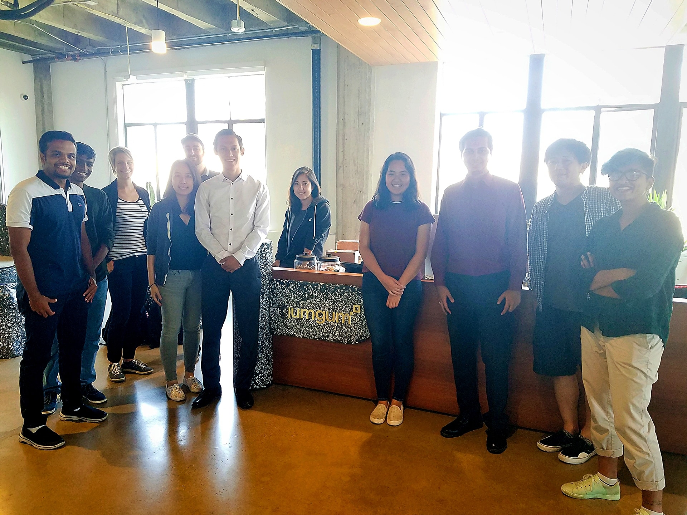

# We are getting published by the IEEE!

It took us ten weeks of hard work, as part of the [Research in Industrial Projects for Students](https://www.ipam.ucla.edu/programs/student-research-programs/research-in-industrial-projects-for-students-rips-2019/) (RIPS) program, jointly supported by the Institute for Pure and Applied Mathematics (IPAM) at UCLA, GumGum Inc., and NSF Grant $$\langle$$DMS$$\rangle$$ 1440415. 

Here's the wonderful team:

+ Amber Hu, Yale University
+ Mohammad Uzair, National University of Sciences & Technology
+ Qiujing Lu, University of California Los Angeles
+ Iris Fu, GumGum Inc.
+ Keishin Nishiyama, GumGum Inc.
+ Sooraj Mangalath Subrahmannian, GumGum Inc.
+ Divyaa Ravichandran, GumGum Inc.

Amber and Mohammad are also RIPS participants and we worked together at IPAM for nine weeks. Near the end of the program, we spent most of our time at the offices as we were wrapping up research, final report and presentation at the very last stroke. It was both physically and mentally challenging and I thank them both for giving their heart and soul to our project. Qiujing is our enthusiastic and supportive academic mentor. She guided pivotal decisions in the project, always having the right paper at the right time, giving us the tools to materialize what was in our minds.

Meeting the [GumGum](https://gumgum.com/) team and working with them was an honor and one of the highlights of the RIPS program. They trusted us with the development of a product that's relevant for the company, and once we had that, being motivated to work was the easy part.

Before the end of the program, we all agreed to pursue publication of our research, and the [IEEE ICMLA 2019](https://www.icmla-conference.org/icmla19/) was our first option. We only had two weeks to write the paper after going back home. I had to catch up with two months worth of school, so I lost a week with that. Everyone else was busy, so we could only start working on the paper exactly one week before the deadline. So we did and, a month after sending our proposal, we got back excellent news. Turns out the IEEE accepted our paper as full paper and gave us a spot for a talk in the Machine Learning in Advanced Machine Vision special session.